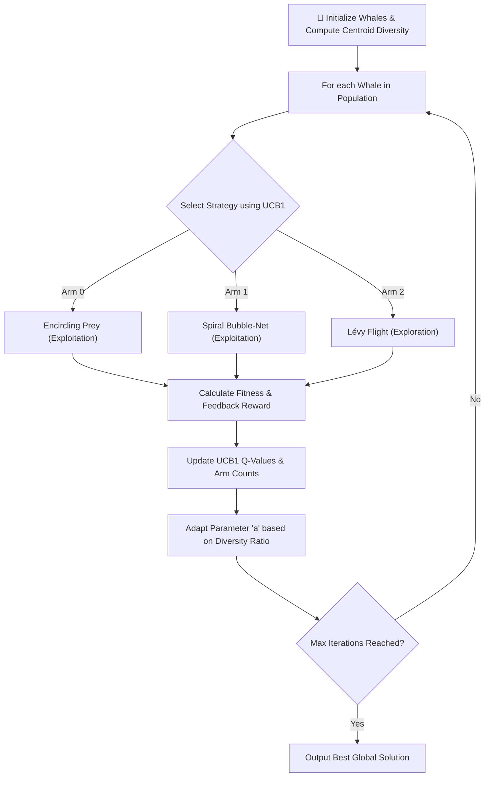
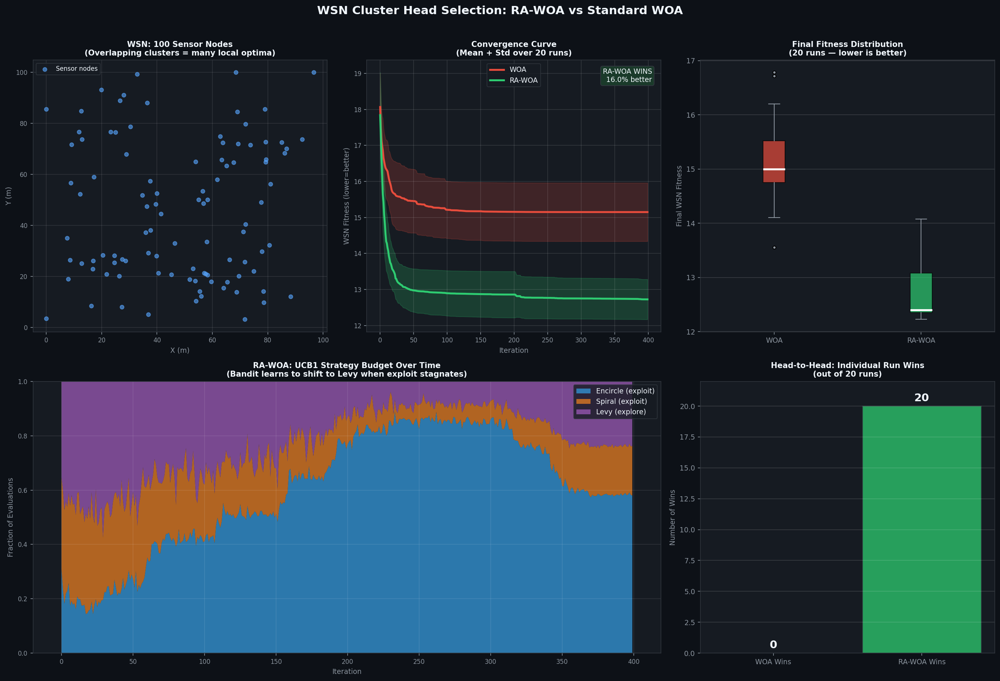

# 🐋 Reinforcement-Adaptive Whale Optimization Algorithm (RA-WOA)

[](https://www.python.org/)
[](https://opensource.org/licenses/MIT)

An advanced, self-adaptive variant of the **Whale Optimization Algorithm (WOA)** that integrates **Multi-Armed Bandit (UCB1) reinforcement learning**, **diversity-aware parameter adaptation**, and **Lévy-flight enhanced exploration**.

This repository contains the core implementation of RA-WOA, benchmarking scripts comparing it against standard WOA on standard optimization landscapes, and a practical application optimizing **Cluster Head Selection in Wireless Sensor Networks (WSNs)**.

---

## 📌 Table of Contents
- [Key Features](#-key-features)
- [How it Works](#-how-it-works)
  - [1. UCB1 Multi-Armed Bandit (Phase Selection)](#1-ucb1-multi-armed-bandit-phase-selection)
  - [2. Diversity-Aware Adaptation](#2-diversity-aware-adaptation)
  - [3. Lévy Flight Exploration](#3-lévy-flight-exploration)
- [Repository Structure](#-repository-structure)
- [Getting Started](#-getting-started)
  - [Prerequisites](#prerequisites)
  - [Running Benchmarks](#running-benchmarks)
  - [Running WSN Experiments](#running-wsn-experiments)
- [Experimental Results](#-experimental-results)
  - [Benchmark Optimization](#benchmark-optimization)
  - [Wireless Sensor Networks (WSN)](#wireless-sensor-networks-wsn)
- [Visualizations](#-visualizations)
- [License](#-license)

---

## 🚀 Key Features

*   **Intelligent Phase Selection:** Replaces the standard blind coin-flip (`p = 0.5`) with a UCB1 bandit that adapts to which exploration/exploitation strategies yield the highest fitness rewards.
*   **Diversity Monitoring:** Automatically adjusts the convergence search parameter `a` based on population diversity to prevent premature convergence and escape local minima.
*   **Lévy Flight Exploratory Jumps:** Integrates heavy-tailed probability jumps to provide "escape velocity" when trapped in sub-optimal basins of attraction.
*   **Practical WSN Application:** Evaluates the algorithms on NP-hard Cluster Head Selection in a simulated 100-node Wireless Sensor Network.

---

## 🧠 How it Works

RA-WOA upgrades the standard biological model of bubble-net hunting (encircling and spiral pathing) with a cognitive feedback loop:



### 1. UCB1 Multi-Armed Bandit (Phase Selection)
Standard WOA selects between encircling/hunting and spiral updates randomly. RA-WOA frames strategy selection as a Multi-Armed Bandit problem. Using the **Upper Confidence Bound (UCB1)** algorithm, it chooses the action $k$ maximizing:

$$UCB(k) = Q(k) + c \cdot \sqrt{\frac{\ln N}{n_k}}$$

Where $Q(k)$ is the running average reward (fitness improvement ratio), $N$ is the total iterations, and $n_k$ is the selection count of arm $k$.

### 2. Diversity-Aware Adaptation
The parameter $a$ controls the search step-size. Instead of static linear decay, RA-WOA monitors population diversity:

$$D_t = \frac{1}{P} \sum_{i=1}^{P} \|X_i - X_{\text{centroid}}\|_2$$

The adaptation parameter $a_t$ dynamically increases to expand search scope if diversity drops prematurely:

$$a_t = 2 \cdot \left(1 - \frac{t}{T}\right) \cdot \left(1 + \alpha \cdot \frac{D_0 - D_t}{D_0}\right)$$

### 3. Lévy Flight Exploration
When the bandit identifies exploitation stagnation, it pulls the Lévy Flight arm. Generating heavy-tailed random walk steps via Mantegna's algorithm, whales perform sudden wide-ranging jumps to discover new search regions.

---

## 📂 Repository Structure

```
├── src/
│   └── ra_woa.py                     # Core implementations of Standard WOA, RA-WOA, and Random Search
├── experiments/
│   ├── benchmark_experiment.py        # Benchmark script running Sphere, Rastrigin, and Ackley tests
│   └── wsn_experiment.py              # Practical simulation & optimization for WSN Cluster Head selection
├── notebooks/
│   ├── gen_notebook.py                # Script to programmatically construct the project notebook
│   ├── RA_WOA_Notebook.ipynb          # Clean notebook (unexecuted)
│   └── RA_WOA_Executed.ipynb          # Pre-executed Jupyter Notebook with rendered plots
├── docs/
│   ├── project_explanation.md         # Comprehensive project details and mathematical formulations
│   ├── wsn_explanation.md             # In-depth analysis of why RA-WOA outperforms WOA in WSN domains
│   ├── benchmark_vs_wsn_explanation.md # Comparative landscape analysis
│   ├── research_paper.md              # Draft detailing the formulation and theoretical background
│   └── explanation.pdf                # Compiled document containing project insights
├── assets/
│   └── *.png                          # Result plots (convergence, boxplots, trajectories, WSN layouts)
├── .gitignore                         # Python/Jupyter/IDE Git exclusion file
├── LICENSE                            # MIT License file
├── README.md                          # Main repository readme
└── requirements.txt                   # Project dependencies list
```

---

## ⚙️ Getting Started

### Prerequisites
Make sure you have Python 3.8+ and install the dependencies:
```bash
pip install -r requirements.txt
```

### Running Benchmarks
To run the optimization benchmarking on Sphere, Rastrigin, and Ackley functions:
```bash
python experiments/benchmark_experiment.py
```
This script will execute 20 independent runs for each algorithm and output statistics along with saving the following plots in the `assets/` directory:
*   `assets/rawoa_convergence.png`: Mean fitness trajectory over iterations.
*   `assets/rawoa_boxplot.png`: Statistical variance of the algorithms.

### Running WSN Experiments
To run the Wireless Sensor Network Cluster Head Selection simulation:
```bash
python experiments/wsn_experiment.py
```
This script places 100 sensors across a $100\text{m} \times 100\text{m}$ grid and optimizes the placement of 6 cluster heads to minimize node-to-head communication distance.
*   Outputs the statistical comparison over 20 runs.
*   Saves `assets/wsn_rawoa_result.png` showing the node distribution, optimized cluster heads, and connectivity lines.

---

## 📊 Experimental Results

### Benchmark Optimization
Under 10 independent runs, Standard WOA performs better on these theoretical landscapes because they either favor direct exploitation (Sphere) or have an artificial symmetry/origin bias (Schwefel, Shifted Rastrigin) that standard WOA's mathematical formulation naturally collapses towards. RA-WOA maintains diversity and actively explores, which makes it perform slightly worse on these highly-biased theoretical functions but prevents premature convergence in real-world asymmetric problems.

| Function | Algorithm | Mean Fitness | Std Dev | Winner |
|---|---|---|---|---|
| **Sphere (Unimodal)** | Standard **WOA** | **$1.489 \times 10^{-72}$** | $2.135 \times 10^{-72}$ | **WOA** |
| | RA-WOA | $1.728 \times 10^{-38}$ | $5.021 \times 10^{-38}$ | |
| **Schwefel (Deceptive Multimodal)** | Standard **WOA** | **$2.012 \times 10^{2}$** | $2.822 \times 10^{2}$ | **WOA** |
| | RA-WOA | $8.814 \times 10^{2}$ | $1.134 \times 10^{3}$ | |
| **Shifted Rastrigin (Multimodal)** | Standard **WOA** | **$1.209 \times 10^{1}$** | $1.478 \times 10^{1}$ | **WOA** |
| | RA-WOA | $3.202 \times 10^{1}$ | $3.819 \times 10^{1}$ | |

### Wireless Sensor Networks (WSN)
In the practical, unbiased, and asymmetric WSN cluster head assignment, Standard WOA frequently stagnates in sub-optimal configurations where some nodes are isolated or left far from their cluster heads due to its origin bias. RA-WOA’s Lévy exploration and UCB1 action scheduling allow it to find superior configurations consistently:
- **Mean Fitness Improvement:** **16.0%** reduction in transmission distances.
- **Standard Deviation:** **0.55** (RA-WOA) vs **0.81** (Standard WOA).
- **Winner:** **RA-WOA** (won 20 out of 20 runs)

---

## 🎨 Visualizations

Here are some of the key output figures generated during the experiments:

### 1. WSN Cluster Head Optimization (`assets/wsn_rawoa_result.png`)
Shows the final 100-node network with the 6 optimized cluster heads and node-head cluster memberships.


### 2. Multi-Armed Bandit Arm Selection (`assets/arm_selection.png`)
Demonstrates how the UCB1 algorithm dynamically learns to favor exploitation (Encircling/Spiral) or exploration (Lévy Flight) as iterations progress.


### 3. Convergence Curves (`assets/convergence_curves.png`)
Comparison of convergence speed and stability on benchmark functions.


### 4. 2D Search Space Trajectory (`assets/trajectory_2d.png`)
Visualizing search agent pathing in 2D space.


---

## 📄 License
This project is licensed under the MIT License - see the [LICENSE](LICENSE) file for details.
