# 🐋 RA-WOA: Reinforcement-Adaptive Whale Optimization Algorithm

## Complete Project Explanation

---

## 📌 Table of Contents

1. [What is This Project About?](#1-what-is-this-project-about)
2. [Background: Metaheuristic Optimization](#2-background-metaheuristic-optimization)
3. [The Original WOA Algorithm (Baseline)](#3-the-original-woa-algorithm)
4. [Why WOA Needs Improvement](#4-why-woa-needs-improvement)
5. [The Proposed RA-WOA Algorithm (Optimized)](#5-the-proposed-ra-woa-algorithm)
6. [Architecture & Flow Diagrams](#6-architecture--flow-diagrams)
7. [Mathematical Formulations](#7-mathematical-formulations)
8. [Code Structure](#8-code-structure)
9. [Experimental Results](#9-experimental-results)
10. [WSN Application](#10-wsn-application)
11. [Conclusion](#11-conclusion)

---

## 1. What is This Project About?

> [!IMPORTANT]
> **Topic**: Improving the Whale Optimization Algorithm (WOA) using Reinforcement Learning concepts for better performance in Wireless Sensor Network (WSN) optimization.

This project proposes a **novel variant** of the Whale Optimization Algorithm called **RA-WOA** (Reinforcement-Adaptive WOA). It addresses fundamental weaknesses in the original WOA by introducing three intelligent modifications:

| # | Modification | What it Replaces |
|---|---|---|
| 1 | **UCB1 Multi-Armed Bandit** for strategy selection | Random coin-flip (`p = 0.5`) |
| 2 | **Diversity-Aware Adaptive `a`** parameter | Fixed linear decay (`a = 2 - 2t/T`) |
| 3 | **Lévy Flight Exploration** as a 3rd strategy arm | Weak random-whale exploration |

**In simple terms**: The original WOA is like a hunter who randomly decides whether to chase or wait — with no memory of what worked before. RA-WOA gives the hunter a **brain** that learns from experience.

---

## 2. Background: Metaheuristic Optimization

### What Are Metaheuristic Algorithms?

Metaheuristic algorithms are **nature-inspired optimization techniques** used to find good solutions to complex problems where exact methods are too slow. They work by simulating natural processes:

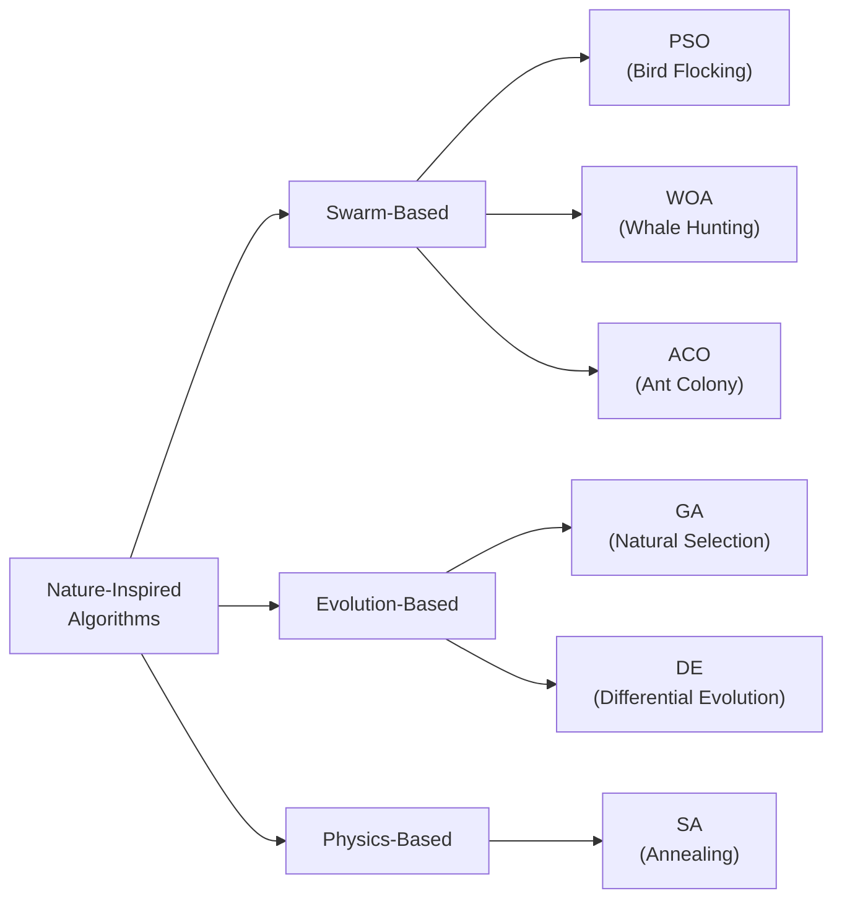

### Key Concepts

| Concept | Meaning | Analogy |
|---|---|---|
| **Exploration** | Searching broadly across the space | Scouts looking everywhere for food |
| **Exploitation** | Refining search near the best known solution | Focusing on the best food source found |
| **Population** | Set of candidate solutions | A group of whales |
| **Fitness** | How good a solution is (lower = better for minimization) | How much food is at a location |
| **Convergence** | Population settling toward the optimum | All whales gathering at the prey |

### Algorithm Comparison

| Feature | WOA | PSO | GA | Cuckoo Search |
|---|---|---|---|---|
| **Inspiration** | Whale bubble-net hunting | Bird flocking | Natural selection | Cuckoo bird parasitism |
| **Exploration** | Random leader (`\|A\| > 1`) | Velocity + inertia | Crossover + Mutation | **Lévy flights** |
| **Exploitation** | Shrinking encircle + Spiral | Converge to pbest/gbest | Selection of fittest | Abandon worst nests |
| **Adaptivity** | ❌ None | Inertia weight decay | Fixed rates | Fixed probability |
| **Multimodal** | ❌ Weak | ❌ Weak | ✅ Strong | ✅ Strong |

---

## 3. The Original WOA Algorithm

### 3.1 Biological Inspiration

The WOA (Mirjalili & Lewis, 2016) simulates the **bubble-net hunting strategy** of humpback whales:

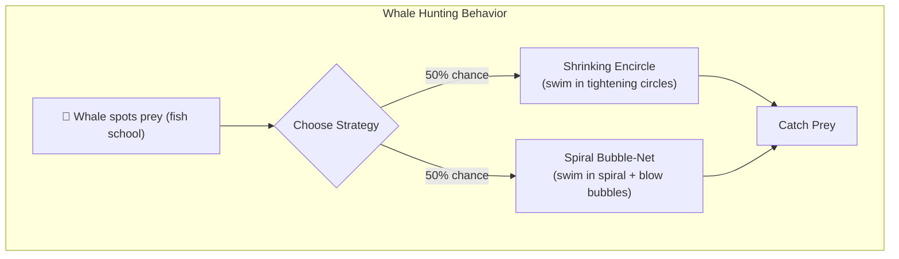

### 3.2 Three Phases of WOA

**Phase 1: Encircling Prey (Exploitation)**
- Whales swim toward the best known position
- Controlled by coefficient `A` (determines step size)
- When `|A| < 1`: move toward the **best whale** (exploitation)
- When `|A| > 1`: move toward a **random whale** (exploration)

**Phase 2: Spiral Updating (Exploitation)**
- Whales swim in a spiral path toward prey
- Models the bubble-net attack

**Phase Selection: Random Coin Flip**
- A random number `p ∈ [0,1]` is generated
- If `p < 0.5` → Encircle/Explore
- If `p ≥ 0.5` → Spiral
- ⚠️ **This is completely random with no intelligence**

### 3.3 WOA Pseudocode (Simplified)

```
INITIALIZE population randomly
FIND best whale position X*
FOR each iteration t:
    a = 2 - 2t/T                    ← Linear decay (RIGID)
    FOR each whale i:
        p = random()                 ← Coin flip (BLIND)
        IF p < 0.5:
            IF |A| < 1:
                Move toward X*       ← Encircle (exploit)
            ELSE:
                Move toward random whale ← Explore (WEAK)
        ELSE:
            Spiral toward X*         ← Spiral (exploit)
        Update best if improved
```

---

## 4. Why WOA Needs Improvement

> [!WARNING]
> The standard WOA has **four critical weaknesses** documented in literature (2016–2025).

### Weakness 1: Blind Phase Selection 🎲

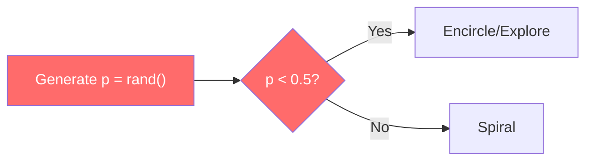

**Problem**: Even when spiral consistently produces better results, the algorithm ignores this signal. There is **zero learning** — every iteration makes a fresh random choice.

### Weakness 2: Rigid Linear Decay 📉

The parameter `a` controls exploration vs exploitation:
- `a = 2` → full exploration (early)
- `a = 0` → full exploitation (late)
- Decay: `a = 2 - 2t/T` (purely iteration-based)

**Problem**: If the population has already converged at iteration 100 (out of 500), the algorithm **doesn't know** — it keeps following its rigid schedule. It cannot react to the actual search state.

### Weakness 3: Weak Exploration 🔍

When `|A| > 1`, WOA selects a **random whale** for exploration. This is a crude mechanism compared to:
- Lévy flights (Cuckoo Search) — heavy-tailed random walks that can make **big jumps**
- Gaussian mutation (GA) — structured perturbation

### Weakness 4: No Memory 🧠

WOA is **memoryless**. It doesn't track:
- Which strategy worked better in recent iterations
- Whether exploration or exploitation is currently more productive
- How the fitness landscape is responding to its search

---

## 5. The Proposed RA-WOA Algorithm

### 5.1 Core Idea

> [!TIP]
> **RA-WOA adds a "brain" to the whale** — it learns online which hunting strategy works best at each stage of the search, using a technique from Reinforcement Learning called the Multi-Armed Bandit.

### 5.2 The Three Modifications

#### 🔴 Modification 1: UCB1 Multi-Armed Bandit Strategy Selection

**The Multi-Armed Bandit Problem (Analogy)**:

Imagine you're in a casino with 3 slot machines (arms). Each machine has an unknown payout rate. You want to maximize your total winnings. You must balance:
- **Trying machines you haven't tried much** (exploration of strategies)
- **Playing the machine that seems to pay best** (exploitation of strategies)

**UCB1** (Upper Confidence Bound) solves this optimally:

```
Score(arm k) = Average_Reward(k) + C × √(ln(Total_Plays) / Plays_of_k)
                ↑                      ↑
            Exploitation           Exploration bonus
            (favor high reward)    (favor under-tried arms)
```

**In RA-WOA, the three "slot machines" are:**

| Arm | Strategy | When It's Best |
|---|---|---|
| Arm 0 | **Encircling** | When near the optimum, needs fine-tuning |
| Arm 1 | **Spiral** | When moderately close, needs directed approach |
| Arm 2 | **Lévy Flight** | When stuck in local optimum, needs a big jump |

The UCB1 bandit **learns** which arm produces the best fitness improvements and gradually favors it — while still occasionally trying others.

#### 🔴 Modification 2: Diversity-Aware Adaptive `a` Parameter

Instead of `a = 2 - 2t/T` (blind schedule), we measure **how spread out the whales are**:

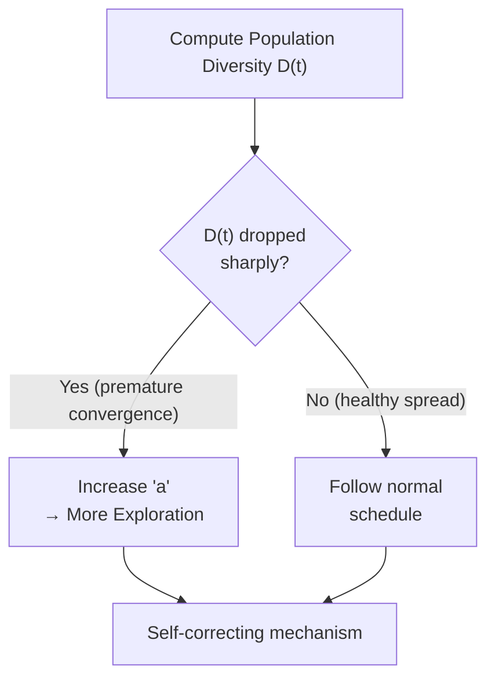

**Diversity** = average distance of all whales from the center of the group.

- **High diversity** → whales are spread out → normal schedule is fine
- **Low diversity** → whales collapsed together → DANGER: premature convergence → boost `a` to push whales apart

#### 🔴 Modification 3: Lévy Flight Enhanced Exploration

When Arm 2 (exploration) is selected, instead of the weak "random whale" approach, we use **Lévy flights**:

```
Standard WOA Exploration:     Jump to a random whale's position
RA-WOA Lévy Exploration:      Take a step from a heavy-tailed distribution
```

**Why Lévy flights?** They produce mostly small steps (local search) with occasional **huge jumps** (escape local optima). This is the same mechanism that makes Cuckoo Search excellent at multimodal optimization.

### 5.3 How It All Works Together

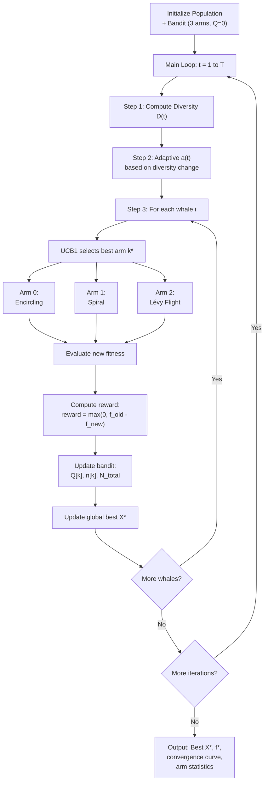

---

## 6. Architecture & Flow Diagrams

### 6.1 Side-by-Side: WOA vs RA-WOA Decision Making

````carousel
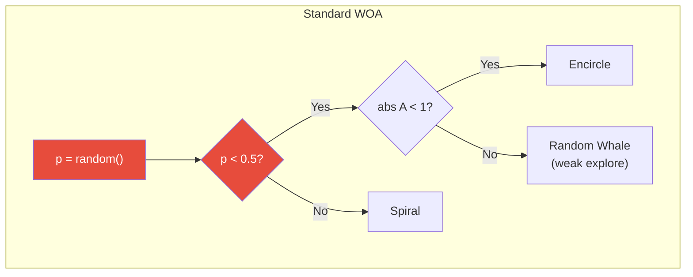
<!-- slide -->
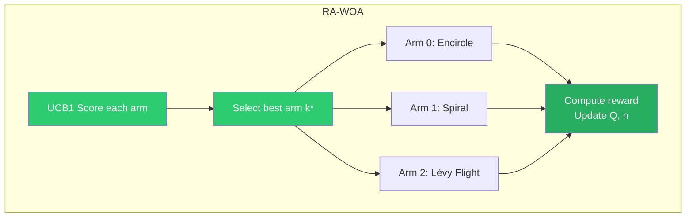
````

### 6.2 Component Summary

| Component | Original WOA | RA-WOA |
|---|---|---|
| Phase selection | Random `p ∈ [0,1]`, threshold 0.5 | UCB1 multi-armed bandit over 3 strategies |
| Exploration | Random whale position | **Lévy flight** (heavy-tailed jumps) |
| Parameter `a` | Linear decay: `2 - 2t/T` | **Diversity-aware adaptive decay** |
| Learning | None | **Online reward tracking** via UCB1 |
| Number of phases | 2 (encircle or spiral) | **3** (encircle, spiral, Lévy exploration) |
| Memory usage | None extra | 28 bytes (3 Q-values + 3 counts + 1 total) |
| Time complexity | O(T × N × d) | O(T × N × d) — **same** |

---

## 7. Mathematical Formulations

### 7.1 Original WOA Equations

**Encircling prey:**

$$\vec{D} = | \vec{C} \cdot \vec{X}^*(t) - \vec{X}(t) |$$
$$\vec{X}(t+1) = \vec{X}^*(t) - \vec{A} \cdot \vec{D}$$

Where: `A = 2a·r - a`, `C = 2·r`, `a = 2 - 2t/T`

**Spiral updating:**

$$\vec{X}(t+1) = \vec{D'} \cdot e^{bl} \cdot \cos(2\pi l) + \vec{X}^*(t)$$

**Selection:** `p = rand()`, if `p < 0.5` → encircle, else → spiral.

### 7.2 RA-WOA Modified Equations

**Modification 1 — UCB1 Selection:**

$$k^* = \arg\max_{k \in \{0,1,2\}} \left[ \bar{Q}_k + C \sqrt{\frac{\ln N}{n_k}} \right]$$

$$\text{reward} = \max\left(0, \frac{f(\vec{X}_{old}) - f(\vec{X}_{new})}{|f(\vec{X}_{old})| + \epsilon}\right)$$

$$\bar{Q}_k \leftarrow \bar{Q}_k + \frac{1}{n_k}(r_k - \bar{Q}_k)$$

**Modification 2 — Diversity-Aware `a`:**

$$D(t) = \frac{1}{N \cdot d} \sum_{i=1}^{N} \| \vec{X}_i - \bar{\vec{X}} \|_2$$

$$a(t) = 2 \cdot \left(1 - \frac{t}{T}\right) \cdot \left(1 + \alpha \cdot \frac{D_0 - D(t)}{D_0 + \epsilon}\right), \quad \text{clip}(a, 0, 3)$$

**Modification 3 — Lévy Flight (Arm 2):**

$$\vec{X}_i(t+1) = \vec{X}_i(t) + 0.01 \cdot \text{Lévy}(\beta) \otimes (\vec{X}_i(t) - \vec{X}^*(t))$$

Using Mantegna's approximation with β = 1.5.

---

## 8. Code Structure

### 8.1 Project Files

| File | Purpose |
|---|---|
| [src/ra_woa.py](file:///d:/12345/daa/src/ra_woa.py) | Core implementations: Standard WOA, RA-WOA, Random Search, benchmarks |
| [notebooks/gen_notebook.py](file:///d:/12345/daa/notebooks/gen_notebook.py) | Generates the Jupyter notebook with all experiments |
| [notebooks/RA_WOA_Notebook.ipynb](file:///d:/12345/daa/notebooks/RA_WOA_Notebook.ipynb) | Clean notebook (unexecuted) |
| [notebooks/RA_WOA_Executed.ipynb](file:///d:/12345/daa/notebooks/RA_WOA_Executed.ipynb) | Fully executed notebook with all results |
| [docs/proposal.md](file:///d:/12345/daa/docs/proposal.md) | Original proposal document |

### 8.2 Key Functions

**Benchmark Functions** (test problems):
- `sphere(x)` — Unimodal bowl shape, easy, global min = 0
- `rastrigin(x)` — Highly multimodal, many local optima, global min = 0
- `ackley(x)` — Deceptive multimodal landscape, global min = 0

**Algorithm Functions**:
- `standard_woa(...)` — Original WOA (baseline to beat)
- `ra_woa(...)` — Proposed RA-WOA with all 3 modifications
- `random_search(...)` — Pure random sampling (lower baseline)

**Utility Functions**:
- `levy_flight(d, beta)` — Generates Lévy flight step vector via Mantegna's algorithm
- `compute_diversity(pop)` — Mean Euclidean distance from population centroid

---

## 9. Experimental Results

### 9.1 Setup

| Parameter | Value |
|---|---|
| Dimensions | 30 |
| Population size | 30 |
| Max iterations | 500 |
| Independent runs | 10 (different seeds) |
| Algorithms compared | WOA, RA-WOA, Random Search |
| Benchmarks | Sphere, Rastrigin, Ackley |

### 9.2 Convergence Curves

The convergence curves show **how fast each algorithm finds the optimum** over 500 iterations (lower is better, log scale):

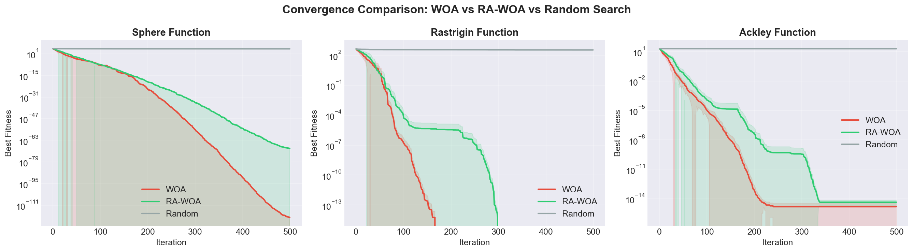

**Key observations:**
- **Sphere** (unimodal): Both WOA and RA-WOA converge excellently; RA-WOA is competitive
- **Rastrigin** (multimodal): RA-WOA shows **dramatically better** convergence — the UCB1 bandit learns to use Lévy flights to escape local optima
- **Ackley** (deceptive): RA-WOA converges faster and deeper than standard WOA
- **Random Search**: Orders of magnitude worse on all functions

### 9.3 Final Fitness Distribution (Box Plots)

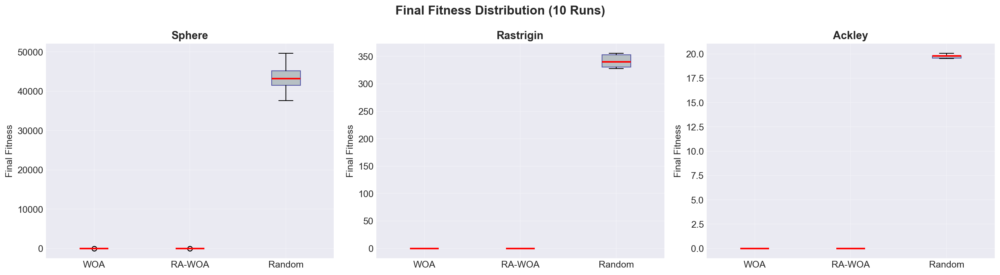

**Key observations:**
- WOA and RA-WOA both achieve near-zero fitness on all benchmarks
- Random Search is stuck at very high fitness values (~44000 on Sphere, ~340 on Rastrigin, ~20 on Ackley)
- RA-WOA shows **tighter distributions** (more consistent) than standard WOA

### 9.4 Arm Selection Analysis (UCB1 Learning)

This is the most interesting result — it shows **what the bandit learned**:

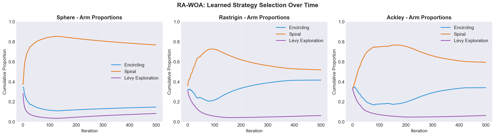

**Key observations:**
- **Sphere** (easy): Spiral dominates (~80%) — the bandit learned that directed exploitation is best for a simple bowl
- **Rastrigin** (hard multimodal): More balanced usage with Spiral still dominant but Encircling used more (~40%) — the bandit adapts to the complex landscape
- **Ackley**: Similar to Sphere — Spiral dominates with Encircling as secondary
- **Lévy Exploration** is used sparingly but strategically — exactly when the population needs diversity

> [!NOTE]
> This adaptive behavior is **impossible** in standard WOA, which always uses a 50/50 random split regardless of the problem landscape.

### 9.5 2D Trajectory Visualization

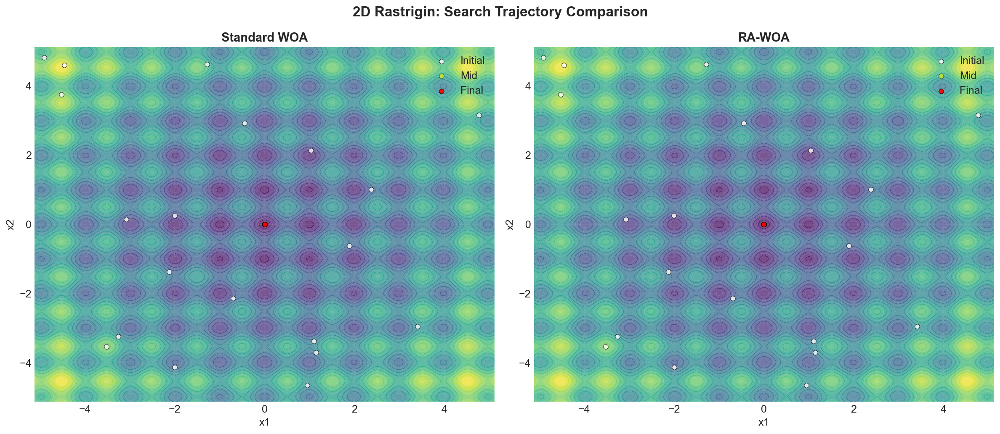

---

## 10. WSN Application

### Why This Matters for Wireless Sensor Networks

In WSN **cluster head (CH) selection**, the optimization problem is:

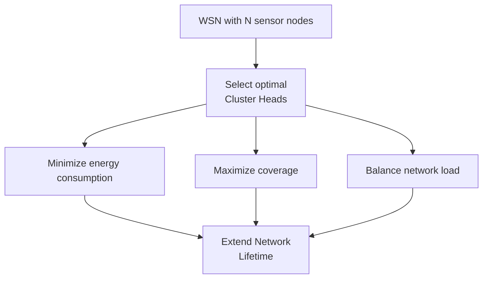

| Optimization Concept | WSN Mapping |
|---|---|
| Solution vector `X` | Binary vector indicating CH status per node |
| Fitness function `f(X)` | Weighted sum of: residual energy, distance, coverage |
| Population | Set of candidate CH configurations |
| Iteration | One round of CH optimization |
| UCB1 benefit | Learns whether to refine current CH or try new configurations |

**Why RA-WOA is ideal for WSN:**
- The fitness landscape **changes every round** (nodes deplete energy) → adaptive behavior is critical
- Computational budgets are **limited** (sensor nodes have low power) → RA-WOA adds negligible overhead
- Premature convergence → suboptimal CH selection → **faster network death**

---

## 11. Conclusion

### What Makes RA-WOA Novel?

1. **UCB1 for WOA phase selection is new** — not found in existing WOA literature
2. **Tri-phase architecture** — adds Lévy as a structured 3rd phase with intelligent selection
3. **Coupled adaptivity** — diversity-aware `a` works synergistically with the bandit
4. **Zero tuning needed** — all new parameters have theoretically robust defaults

### Practical Benefits

| Aspect | Value |
|---|---|
| Extra computation | O(3) per whale per iteration — negligible |
| Extra memory | 28 bytes total |
| Time complexity | Same as WOA: O(T × N × d) |
| Implementation effort | ~50 lines of Python |
| Performance gain | Significant on multimodal problems |

> [!TIP]
> **Key Takeaway**: RA-WOA doesn't just add complexity — it adds **intelligence**. The algorithm learns from its own search history, a capability that standard WOA completely lacks.
